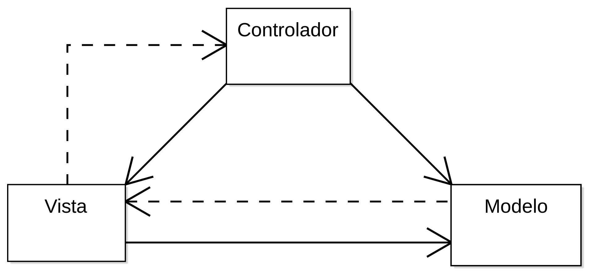

# Calendario Maya

Creación de un calendario maya (Chulq'il, Haab y Rueda Calendárica) para Java

Consiste en un programa en donde se pueda visualizar las fechas en los diferentes subsistemas del Calendario Maya.
Se utilizará Java como lenguaje y el patrón de diseño Modelo-Vista-Controlador.

## ¿En qué consiste el patrón que vamos a utilizar?

- El modelo es el encargado de manipular la base de datos que vamos a utilizar. Algo así como un tipo CRUD, pero para este caso se hara solo Read, pues no es lógico crear o eliminar Nahuales, energias o días.
- El controlador es el encargado de ser el intermedio entre el modelo y la vista, es decir, que son los métodos que realizan las acciones en las GUIs. Recuerden que las GUIs deben ser tontas y no deben tener una lógica de programación grande.
- Las vistas son las GUIs que ya todos conocemos. :shipit:

*Si alguien tiene una sugerencia o pregunta puede hacerlo en el chat de Whatsapp.*

Teoria de Sistemas Segundo Semestre 2019, 
Universidad de San Carlos de Guatemala,  
Centro Universitario de Occidente.
